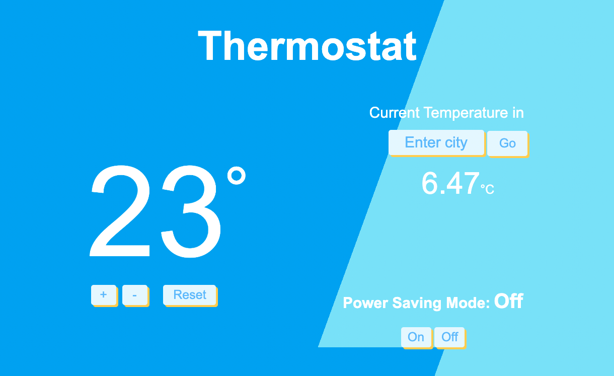
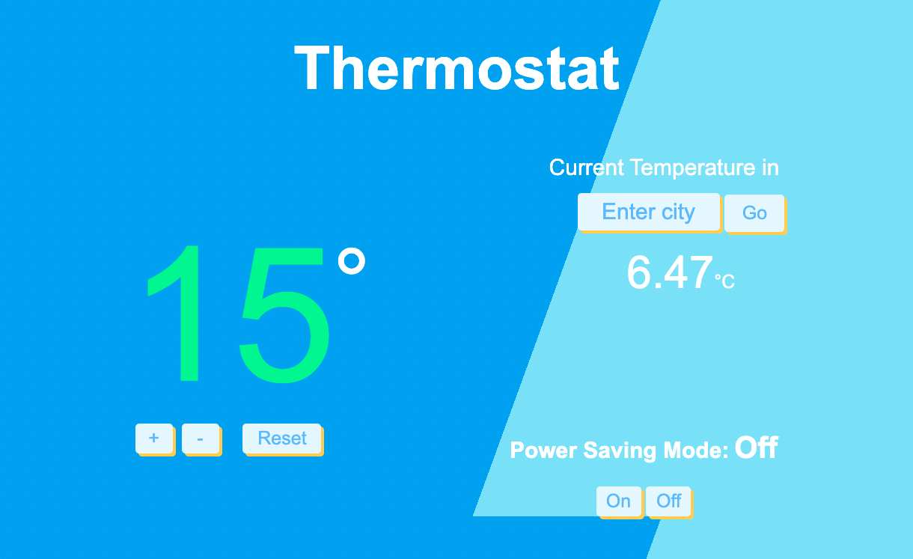
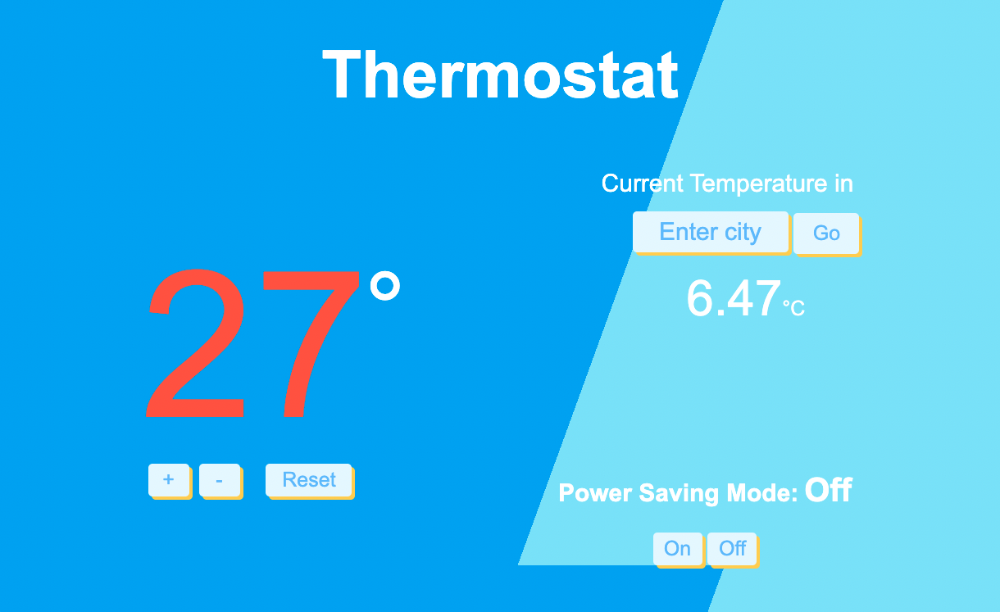
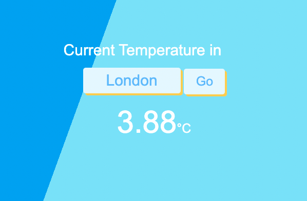

# Thermostat 
I created this programme as part of a challenge at [Makers Academy](http://www.makersacademy.com). 

The app has been created with JavaScript, CSS and HTML. Test driven using Jasmine.



## Getting Started ##

1. Clone this repository.

  ```shell
  $ git clone git@github.com:Mintar89/thermostat.git
  ```

2. Navigate into the folder.

  ```shell
  $ cd thermostat
  ```

## Usage ##

Open `index.html` in your browser.

  ```shell
  $ open index.html
  ```

## Running tests ##

Open `SpecRunner.html` in your browser.

  ```shell
  $ open SpecRunner.html
  ```

## Functionality ##

1. The thermostat has two buttons which control an increase and decrease in the household's temperature. 

2. The temperature can be reset to 20 degrees by clicking the reset button.

3. As the temperature is changed by the user, the temperature colour will change dynamically to reflect the energy-cost status.

Green: low usage.



White: average usage.

Red: high usage.



3. The user has the option to enable or disable Power Saving Mode. If this option is enabled, the household is limited to a maximum temperature of 25 degrees to reduce energy costs. If this option is disabled, the maximum temperature is 32 degrees.

5. The user can check the current temperature of any city in the world, through the open weather API.



## Specification ##

- Thermostat starts at 20 degrees
- You can increase the temperature with an up function
- You can decrease the temperature with a down function
- The minimum temperature is 10 degrees
- If power saving mode is on, the maximum temperature is 25 degrees
- If power saving mode is off, the maximum temperature is 32 degrees
- Power saving mode is on by default but it can also be turned off
- You can reset the temperature to 20 with a reset function
- You can ask about the thermostat's current energy usage: < 18 is low-usage, <= 25 is medium-usage, anything else is high-usage.
- (In the challenges where we add an interface, low-usage will be indicated with green, medium-usage indicated with black, high-usage indicated with red.)


